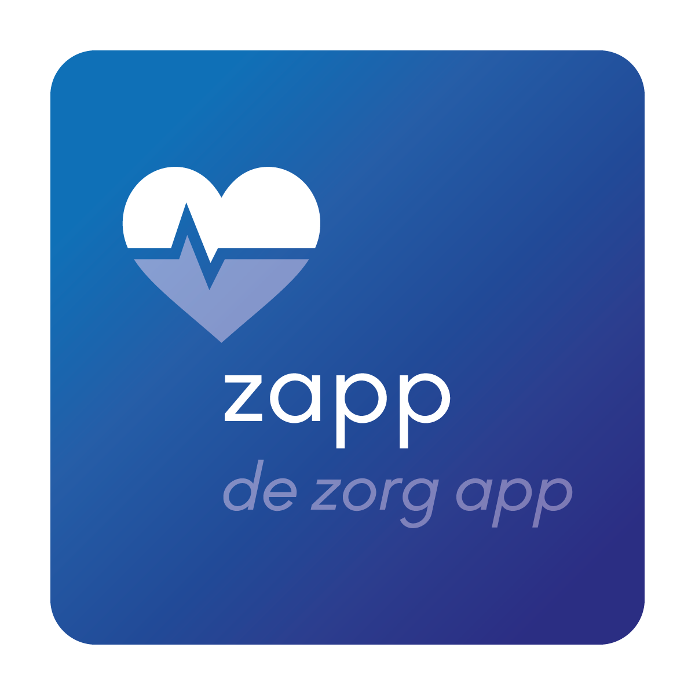
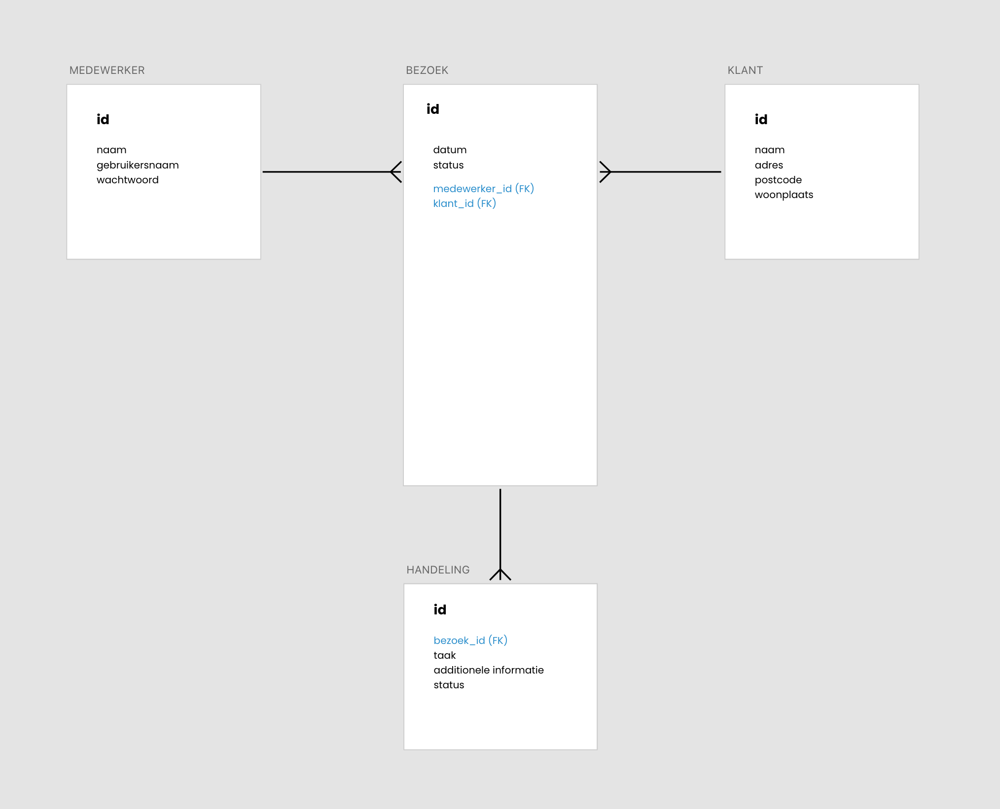
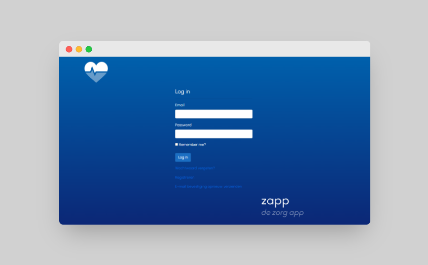
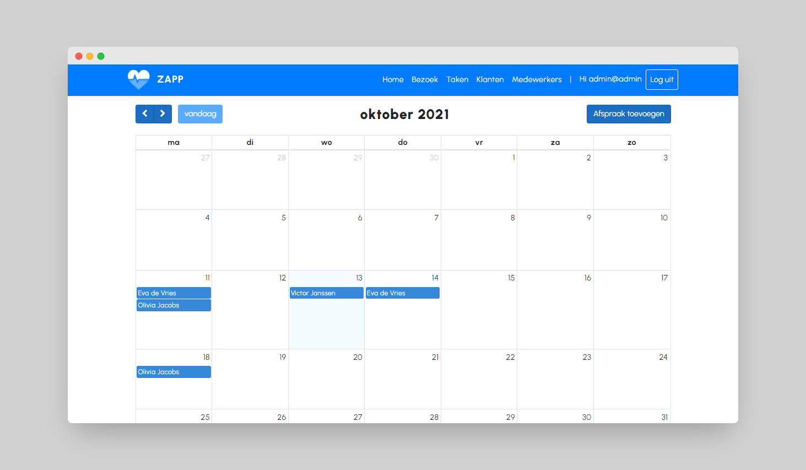
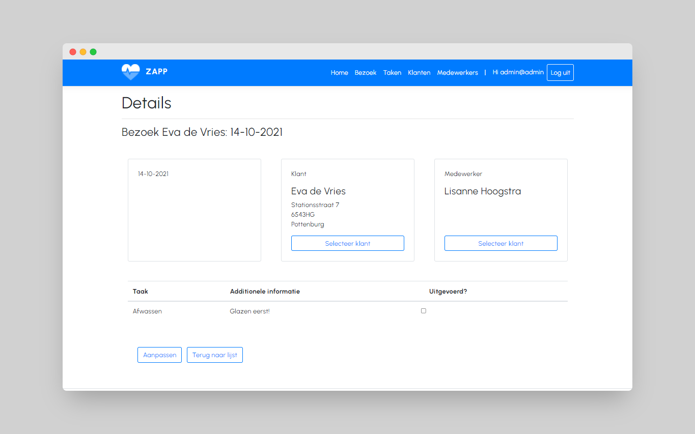

# ZAPP
Een applicatie waarmee thuiszorg-medewerkers efficiënt hun zorgtaken mee kunnen verrichten bij hun cliënten.

# Structuur van de applicatie
De applicatie bestaat uit drie onderdelen, te weten:

- De backoffice (web applicatie);
- De API;
- De mobile app

# Technologieën
Zowel de web applicatie als de API worden vervaardigd in:
- C# / ASP.NET Core / Razor Pages / Entity Framework

De mobiele app wordt gemaakt met: 
- React Native 
- De data wordt opgehaald via API

# Methoden en Technieken
## Entity Relationship Diagram
Dit diagram toont het conceptueel datamodel. Het is een visuele weergave van de entiteiten, relaties en regels die gelden of aanwezig zijn. 

# Screenshots project
## Web app
### Login page

### Overview page

### Visit detail page

